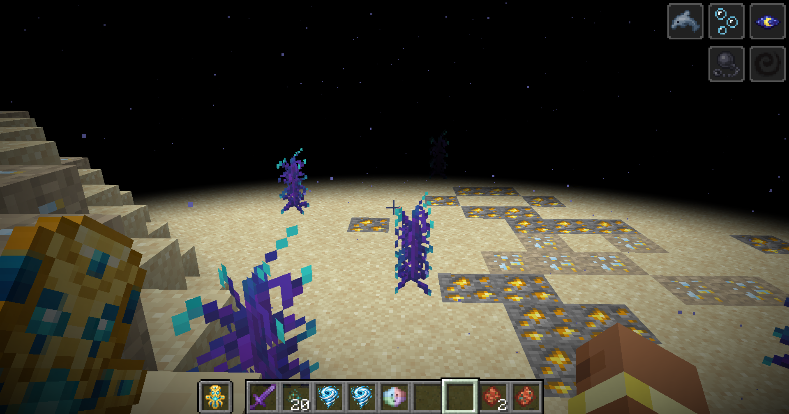
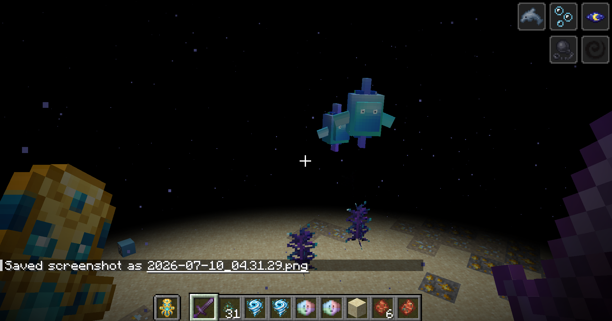
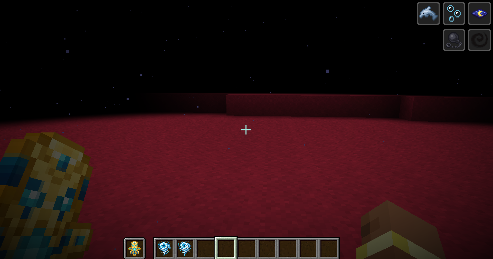
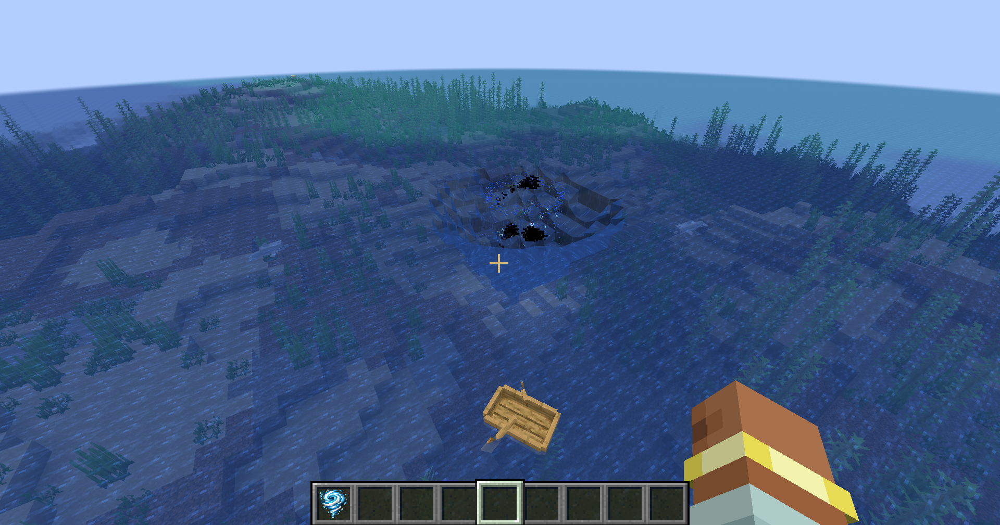
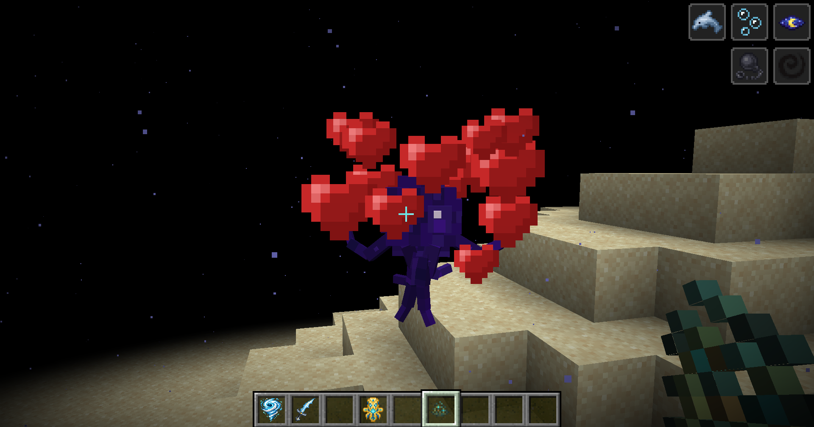

# Abyssal Planet


**Abyssal Planet** is a Forge 1.20.1 adventure mod that opens a path to a vast underwater dimension filled with hostile environments, mysterious ecosystems, tameable companions, rare resources and colossal sea monsters.

> Abyssal Planet is under active development. Existing worlds should be backed up before installing a new version.



## Highlights

- A complete underwater dimension entered through a growing typhoon.
- Three distinct regions: **Deep Abyssal**, **Abyssal Valley** and **Decay Road**.
- Environmental dangers including pressure, darkness, currents and toxic red water.
- Custom ores, Blue Gold trees, abyssal algae and valuable creature materials.
- Tameable Baby Krakens, Zwoings, Georges Junior, Georges Senior and rare companions.
- Major encounters against the Kraken, Abyssal Serpent and Georges-Briochard.
- Abyssal Poacher groups roaming Decay Road, with a surviving poacher able to become the formidable Abyssal Wanderer.
- A wearable Wanderer Mask and a rare placeable Abyssal Cult Banner with a unique ritual emblem.
- Unique weapons including the Golden Blue Dagger, Abyssal Staff and Abyssal Hunter's Crossbow.
- Multiplayer storage, teleportation and companion mechanics.
- Custom models, animations, particles, sounds and ambient music.

## Gallery

| Abyssal wildlife | Decay Road |
| --- | --- |
|  |  |

| Entering the Abyss | A loyal companion |
| --- | --- |
|  |  |

## Requirements

- Minecraft Java Edition **1.20.1**
- Minecraft Forge **47.4.20 or newer for 1.20.1**
- Java **17**
- GeckoLib **4.8.4 or newer for Forge 1.20.1**

## Installation

1. Install Minecraft Forge for Minecraft 1.20.1.
2. Install GeckoLib for Forge 1.20.1.
3. Download the latest Abyssal Planet JAR from the CurseForge project page.
4. Place both mod JARs inside the Minecraft `mods` directory.
5. Start Minecraft with the matching Forge profile.

Client and dedicated server must use the same Abyssal Planet version.

## Documentation

- [Getting Started](docs/GETTING_STARTED.md)
- [Biomes and Exploration](docs/BIOMES.md)
- [Creatures and Companions](docs/CREATURES.md)
- [Bosses](docs/BOSSES.md)
- [Items and Equipment](docs/ITEMS_AND_EQUIPMENT.md)
- [Frequently Asked Questions](docs/FAQ.md)
- [Changelog](CHANGELOG.md)

## Building from Source

Clone the repository and run:

```powershell
.\gradlew clean build
```

The compiled mod will be generated in `build/libs`.

## Reporting Issues

Please use the GitHub issue templates and include:

- Abyssal Planet version
- Forge and GeckoLib versions
- Singleplayer or dedicated server
- Reproduction steps
- Relevant logs or crash reports

## License

Abyssal Planet is distributed under **All Rights Reserved**. The source is available for transparency and issue investigation, but copying, redistribution, modification or commercial reuse is not permitted without explicit permission from the author. Third-party components retain their respective licenses. See [LICENSE.md](LICENSE.md).

Minecraft is a trademark of Microsoft. This project is not affiliated with Mojang Studios or Microsoft.
